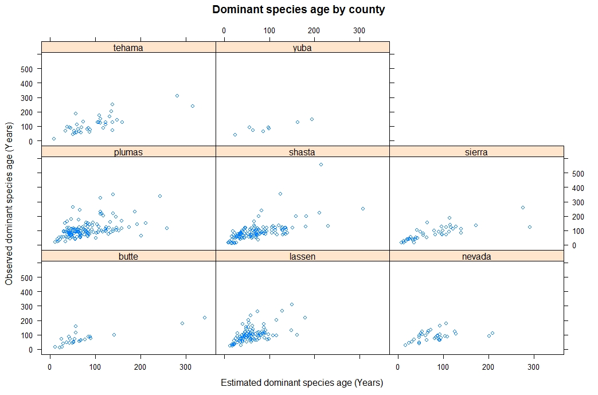

# Forest inventory creation for Plumas National Park , California

## Overview of the project
purpose of the work was to examine the distribution of volume, species, ownership, dominant tree height and dominant tree age of the FIA plot in 8 counties around Plumas National Forest, California.  

## Study area
Eight counties in CA.
- Plumas
- Shasta
- Lassen
- Tehama
- Butte
- Sierra
- Nevada
- Yuba

## Original data
The original data is downloaded from FIA DataMart. SQLite3 State databases for the state of California is used.  

https://apps.fs.usda.gov/fia/datamart/datamart.html

As the original data exceeded the upload size limit of Github, I provide the link to the file on my Google Drive.

https://drive.google.com/open?id=1lFP1H1lEspKCZJIw-iZ_omxAiJAVnitZ

 I referred to the FIA documentation(I call it as the FIA document from here) to acquire the detailed information about the variables in FIA.

 _The Forest Inventory and Analysis Database: Database Description and User Guide for Phase 2 (version 8.0)_

National standard plot design is as follow. Except 1994, all the plots are measured based on this protocol.

> National plot design consists of four 24-foot fixed-radius subplots for
trees 5 inches d.b.h., and four 6.8-foot fixed-radius microplots for
seedlings and trees 1 and <5 inches d.b.h. Subplot 1 is the center plot,
and subplots 2, 3, and 4 are located 120.0 feet, horizontal, at azimuths
of 360, 120, and 240, respectively. The microplot center is 12 feet east
of the subplot center. Four 58.9-foot fixed-radius macroplots are
optional. A plot may sample more than one condition. When multiple
conditions are encountered, condition boundaries are delineated
(mapped). (I-1)

## SQL works
`CountyInv` is the SQL code file. It contains the sql code to query the data from the original data. FIA field plot data for 8 counties are queried.

https://www.fia.fs.fed.us/library/database-documentation/current/ver80/FIADB%20User%20Guide%20P2_8-0.pdf

FIPS code for CA is retrieved from

https://www.weather.gov/hnx/cafips

### Volume per acre calculation

Per acre cubic feet volume  for each plot is calculated following the FIA documentation. 

>Net cubic-foot volume. For timber species (trees where the diameter is measured at
breast height d.b.h.), this is the net volume of wood in the central stem of a sample tree
5.0 inches d.b.h., from a 1-foot stump to a minimum 4-inch top diameter, or to where the
central stem breaks into limbs all of which are <4.0 inches in diameter. For woodland
species (woodland species can be identified by REF_SPECIES.WOODLAND = X),
VOLCFNET is the net volume of wood and bark from the d.r.c. measurement point(s) to a 1½-inch top diameter; includes branches that are at least 1½ inches in diameter along
the length of the branch. This is a per tree value and must be multiplied by TPA_UNADJ to
obtain per acre information. This attribute is blank (null) for trees with DIA <5.0 inches.
All trees measured after 1998 with DIA 5.0 inches (including standing dead trees) will
have entries in this field. Does not include rotten, missing, and form cull (volume loss due
to rotten, missing, and form cull defect has been deducted).(3-20)

other forest attributes queried from FIA database are as follow.
- lastInvYr: The last year that inventory for the plot was created/updated.
- primarySpecies: Primary species group name. I took the mode of the species code within a plot.
- secondarySpecies: Secondary species group name.
- owner: Ownership description.
- volPerAcre: cubic feet per acre volume.
- dominantTreeHeight: The highest tree's height in feet. 
- dominantTreeAge: the age of the highest tree in a plot
- SI: Site index.

`originalData/FIAData_plumasCA.csv` is the queried table for pulmas county. Individual tree data is included in this data table. 

## Data aggregation
Data aggregation is done in R. `DataAggregation.R` is used to aggregate the individual tree data into the plot-level data. The variables taken from the FIA sample plot data was summarized for each plot ID that is unique to individual plot. As a result, data for 1183 plots are collected.

The outcome of the aggregation is written out to the `plotData/FIAData_plumasCA_plot.csv`. Followings are the description of the columns.

The volume per acre is computed by (number of trees) x (volume per tree)

# Dominant tree height and dominant tree age
The dominant tree height is the mean tree height of the top 20% trees among the primary species within a plot. 

Dominant tree age is the mean breast height age of the top 20% trees among the primary species. FIA data does not provide the breast height age for  68.5% of the trees. Therefore, dominant tree age is estimated from the given height equations presented in _”SITE INDEX SYSTEMS FOR MAJOR
YOUNG-GROWTH FOREST AND WOODLAND SPECIES IN NORTHERN CALIFORNIA”(
https://www.fire.ca.gov/media/3789/forestryreport4.pdf)_ 
The solution of the height equations for the age is summarized in `FIA_project_solutions.pdf`.

## Area and volume in the county
Area and volume in the county is retrieved from _evalidator_. 

Although I retrieved only the total area and volume, by using 
_evalidator_, it is possible to get the area and volume by stand class, species group,..,etc. 

## Results
CSV files that contains all the attributes are in `summaryData` directory.
I do not fully investigate and discuss about the data I created as the scope of this work is to create the csv files. However I show some figures that illustrates the condition of the forest resources in this region. 

